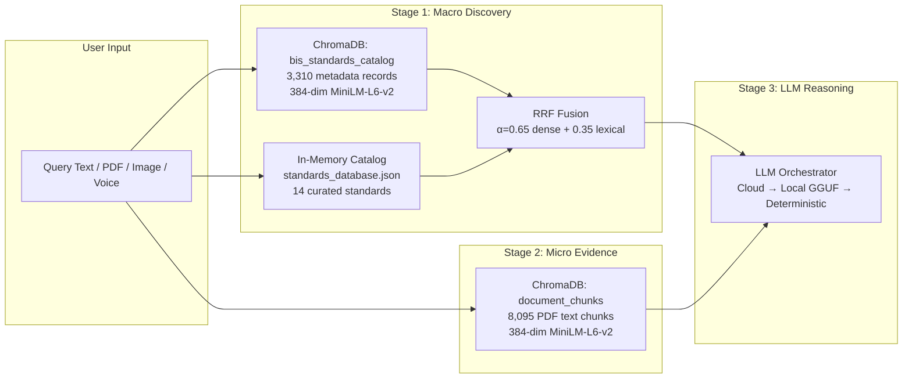
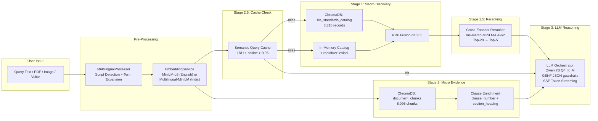
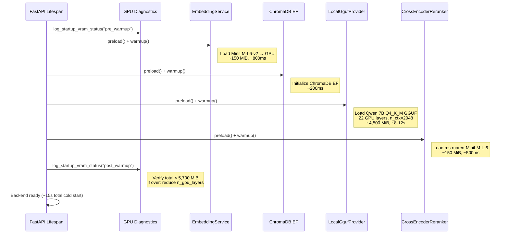
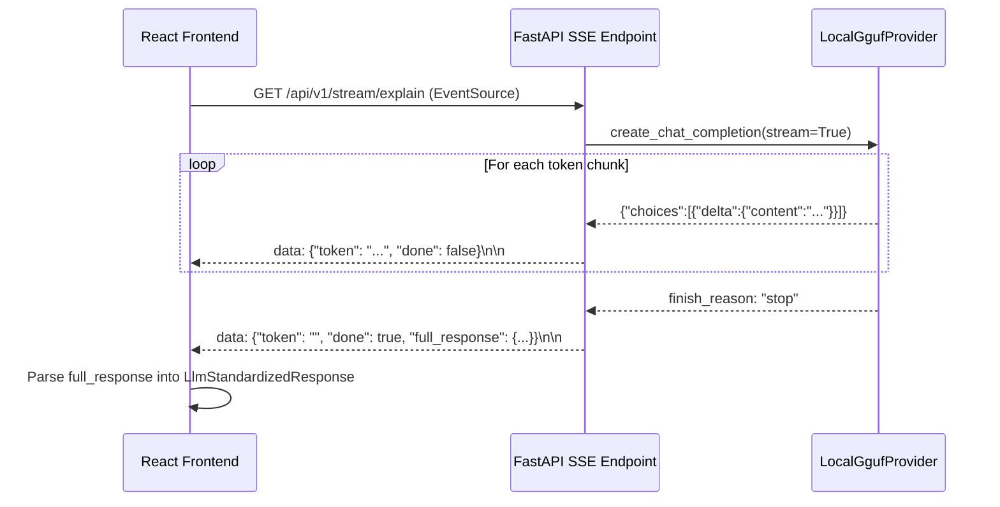

# AI-Powered Indian Standards Recommendation Engine — Architectural Gap Analysis & Implementation Plan

## Executive Summary

The `D:\CODE\Hackathon` repository contains a **remarkably complete** BIS-SpecAI system with 18 engine modules, 6 API routers, 4 parser modules, 16 React components, 28 test suites, and two populated ChromaDB vector stores (3,310 catalog records + 8,095 PDF text chunks). The codebase already covers all 6 DoCA Expected Features at a **functional prototype** level. However, rigorous gap analysis against the official problem statement reveals **15 specific production-readiness gaps** that separate the current implementation from a competition-winning, demo-ready system.

This plan maps every gap, designs precise fixes, and lays out a 5-day execution timeline targeting the RTX 3050 6GB hardware constraint.

---

## 1. System Audit & Gap Analysis

### 1.1 Feature Coverage Matrix

| # | DoCA Expected Feature | Status | Backend Coverage | Frontend Coverage | Gap ID |
|---|---|---|---|---|---|
| **F1** | Accept product descriptions, specs, or tender PDFs as input | ✅ **Complete** | [`pipeline.py`](file:///d:/CODE/Hackathon/backend/engine/pipeline.py) accepts text, PDF bytes, image bytes, and audio bytes. [`document_parser.py`](file:///d:/CODE/Hackathon/backend/parsers/document_parser.py) handles PDF/DOCX/TXT/images with OCR fallback. | [`SearchBar.tsx`](file:///d:/CODE/Hackathon/frontend/src/components/SearchBar.tsx) + [`TenderAnalyzerView.tsx`](file:///d:/CODE/Hackathon/frontend/src/components/TenderAnalyzerView.tsx) with file upload and raw text | — |
| **F2** | Recommend relevant IS based on deep semantic understanding | ✅ **Functional** | [`hybrid_retriever.py`](file:///d:/CODE/Hackathon/backend/engine/hybrid_retriever.py) dual-index (ChromaDB dense + lexical fuzzy via `rapidfuzz`). RRF fusion with configurable `hybrid_alpha=0.65`. | [`RecommendationCard.tsx`](file:///d:/CODE/Hackathon/frontend/src/components/RecommendationCard.tsx) | G1, G2, G3 |
| **F3** | Identify allied standards (normative, test, safety, installation) | ✅ **Complete** | [`normative_resolver.py`](file:///d:/CODE/Hackathon/backend/engine/normative_resolver.py) resolves 4 relationship types. [`AlliedStandardItem`](file:///d:/CODE/Hackathon/backend/models/recommendation_model.py) model. | [`AlliedStandardsView.tsx`](file:///d:/CODE/Hackathon/frontend/src/components/AlliedStandardsView.tsx) with sub-tabs | G4 |
| **F4** | Highlight latest version and amendments, flag deprecated | ✅ **Functional** | [`NormativeResolver.check_deprecation()`](file:///d:/CODE/Hackathon/backend/engine/normative_resolver.py#L70-L77) flags `SUPERSEDED`. Model has `reaffirmation_year`, `amendments[]`, `superseded_by`. | [`RecommendationCard.tsx`](file:///d:/CODE/Hackathon/frontend/src/components/RecommendationCard.tsx) shows deprecation warnings | G5 |
| **F5** | Suggest mandatory certification (ISI/CRS/BEE/QCO) | ✅ **Complete** | [`certification_advisor.py`](file:///d:/CODE/Hackathon/backend/engine/certification_advisor.py) + [`QcoRegistry`](file:///d:/CODE/Hackathon/backend/ingestion/qco_registry.py) with 13 statutory entries. | [`QcoExplorerView.tsx`](file:///d:/CODE/Hackathon/frontend/src/components/QcoExplorerView.tsx) | G6 |
| **F6** | Support multilingual input (Hindi/Indic) and conversational queries | ✅ **Functional** | [`multilingual_processor.py`](file:///d:/CODE/Hackathon/backend/engine/multilingual_processor.py) with 19 Indic-to-English term mappings. Detects Devanagari/Tamil/Telugu/Bengali scripts. [`AssistantChatDrawer`](file:///d:/CODE/Hackathon/frontend/src/components/AssistantChatDrawer.tsx) for conversational Q&A. | Search bar has Indic quick query pills + voice input | G7, G8 |

### 1.2 Identified Gaps

#### Retrieval Quality Gaps

| Gap ID | Gap Title | Severity | Current State | Required State |
|---|---|---|---|---|
| **G1** | No cross-encoder reranker after initial retrieval | 🔴 HIGH | Raw hybrid scores (dense + lexical) are returned without precision reranking | Add a lightweight cross-encoder reranker (e.g., `bge-reranker-v2-m3` or `ms-marco-MiniLM-L-6-v2`) as Stage 2 after dual-index retrieval to dramatically improve top-5 precision |
| **G2** | Token streaming not implemented for LLM responses | 🔴 HIGH | All LLM responses are blocking — `await self._llm.execute(contract)` returns the complete response only after all tokens are generated | Implement SSE (Server-Sent Events) streaming from the local GGUF provider's `create_chat_completion(stream=True)` through FastAPI `StreamingResponse` to the React frontend |
| **G3** | PDF clause-level citation schema incomplete | 🟡 MEDIUM | [`DocumentChunkEvidence`](file:///d:/CODE/Hackathon/backend/models/recommendation_model.py#L17-L27) has `page_number` and `snippet` but no exact clause number, section header, or line-range reference | Enrich chunk metadata with `clause_number`, `section_heading`, and `char_offset_start/end` fields extracted during chunking |

#### Tender Compliance Gaps

| Gap ID | Gap Title | Severity | Current State | Required State |
|---|---|---|---|---|
| **G4** | No numeric Compliance Score (0-100) for tender audit | 🔴 HIGH | [`TenderAnalysisReport`](file:///d:/CODE/Hackathon/backend/models/tender_model.py#L28-L35) has `mandatory_qco_coverage` percentage but no holistic weighted compliance score with penalty decomposition | Design and implement a scored compliance engine with 4 penalty categories: Outdated Standard (-15), Missing QCO (-20), Ambiguity (-10), Missing Standard Ref (-12) |
| **G5** | No `WITHDRAWN` status handling distinct from `SUPERSEDED` | 🟡 MEDIUM | [`StandardStatus`](file:///d:/CODE/Hackathon/backend/models/standard_model.py#L8-L12) has `WITHDRAWN` enum value but [`check_deprecation()`](file:///d:/CODE/Hackathon/backend/engine/normative_resolver.py#L70-L77) only checks `SUPERSEDED`, ignoring `WITHDRAWN` | Add `WITHDRAWN` detection with distinct user-facing warning text |
| **G6** | Hallmarking scheme not fully covered | 🟢 LOW | [`CertificationScheme`](file:///d:/CODE/Hackathon/backend/models/standard_model.py#L15-L21) defines `HALLMARKING` enum but [`certification_advisor.py`](file:///d:/CODE/Hackathon/backend/engine/certification_advisor.py) has no branch for it | Add Hallmarking advisory text to `get_certification_alert()` |

#### Multilingual & Voice Gaps

| Gap ID | Gap Title | Severity | Current State | Required State |
|---|---|---|---|---|
| **G7** | Multilingual embedding model not loaded for non-English queries | 🔴 HIGH | [`config.yaml`](file:///d:/CODE/Hackathon/backend/config/config.yaml#L19) configures `paraphrase-multilingual-MiniLM-L12-v2` but [`EmbeddingService`](file:///d:/CODE/Hackathon/backend/engine/embedding_service.py) only loads the English `all-MiniLM-L6-v2` — Indic queries are translated to English keywords first, losing semantic nuance | When `detected_language != "en"`, route embedding through the multilingual model for richer Hindi/Indic vector representations |
| **G8** | Hindi TTS model path configured but not dynamically selected | 🟡 MEDIUM | [`config.yaml`](file:///d:/CODE/Hackathon/backend/config/config.yaml#L40) has `tts_hin_model_path` but [`VoiceService.synthesize_speech()`](file:///d:/CODE/Hackathon/backend/engine/voice_service.py#L72-L101) always loads `tts_eng_model_path` | Add language parameter to TTS synthesis and conditionally load Hindi model when response language is Hindi |

#### Hardware & Performance Gaps

| Gap ID | Gap Title | Severity | Current State | Required State |
|---|---|---|---|---|
| **G9** | Config discrepancy: `config.yaml` loads Gemma-2B (1.7 GB) while `settings.py` defaults to Qwen-7B (4.7 GB) | 🔴 HIGH | [`config.yaml` L28](file:///d:/CODE/Hackathon/backend/config/config.yaml#L28) points to `gemma-2-2b-it-Q4_K_M.gguf` with `n_gpu_layers=99` and `chat_format=gemma`. [`settings.py` L40-41](file:///d:/CODE/Hackathon/backend/config/settings.py#L40-L41) defaults to `Qwen2.5-7B-Instruct-Q4_K_M.gguf` with `n_gpu_layers=18` and `chat_format=chatml`. Since `config.yaml` is loaded, the YAML wins — but the Gemma 2B model is significantly weaker for procurement reasoning than Qwen 7B | Resolve: use Qwen 7B with `n_gpu_layers=22`, `n_ctx=2048`, KV cache Q8_0 quantization (`type_k=8`, `type_v=8`) to fit within 5.5 GB VRAM |
| **G10** | No VRAM budget guard at startup | 🟡 MEDIUM | [`gpu_diagnostics.py`](file:///d:/CODE/Hackathon/backend/engine/gpu_diagnostics.py) logs VRAM but doesn't enforce a budget ceiling | Add a configurable `max_vram_mb` setting; if `allocated_mb > max_vram_mb` after warmup, auto-downgrade `n_gpu_layers` |
| **G11** | Embedding GPU disabled by default | 🟡 MEDIUM | [`config.yaml` L23](file:///d:/CODE/Hackathon/backend/config/config.yaml#L23): `enable_gpu: false` — embeddings run on CPU adding ~200ms latency per query | Enable GPU for embeddings (MiniLM-L6-v2 uses <150 MB VRAM) |

#### Architectural Gaps

| Gap ID | Gap Title | Severity | Current State | Required State |
|---|---|---|---|---|
| **G12** | No SSE/WebSocket streaming architecture | 🔴 HIGH | All endpoints return complete JSON responses; no progressive rendering | Add `/api/v1/stream/recommend` and `/api/v1/stream/explain` SSE endpoints; update React with `EventSource` consumption |
| **G13** | No semantic query caching | 🟡 MEDIUM | Every query hits ChromaDB + embedding model + LLM; identical or near-identical queries are re-processed from scratch | Add a thread-safe LRU embedding similarity cache that returns cached results when cosine similarity > 0.95 |
| **G14** | Frontend lacks tender compliance score gauge/visualization | 🟡 MEDIUM | [`TenderReportView.tsx`](file:///d:/CODE/Hackathon/frontend/src/components/TenderReportView.tsx) shows item counts but no visual compliance gauge | Add an animated circular score gauge (0-100) with color-coded severity bands |
| **G15** | No structured JSON output guardrails for LLM | 🟡 MEDIUM | [`_synthesize()`](file:///d:/CODE/Hackathon/backend/engine/llm_orchestrator.py#L45-L58) manually constructs `LlmStandardizedResponse` fields from raw LLM text, which may truncate or lose detailed analysis | Use `llama-cpp-python` GBNF grammar or `response_format={"type":"json_object"}` to constrain LLM output to the exact `LlmStandardizedResponse` JSON schema |

---

## 2. Dual-Index RAG & Data Architecture

### 2.1 Current Dual-Index Architecture (What Exists)



### 2.2 Enhanced Dual-Index Architecture (Proposed)



### 2.3 Enriched Citation Schema

The current [`DocumentChunkEvidence`](file:///d:/CODE/Hackathon/backend/models/recommendation_model.py#L17-L27) model needs 3 new fields:

```python
class DocumentChunkEvidence(BaseModel):
    # ... existing fields ...
    clause_number: str = ""        # e.g., "6.2.1", "Table 3", "Annex A"
    section_heading: str = ""      # e.g., "Chemical Requirements", "Test Procedure"
    char_offset_start: int = 0     # Character offset within the original PDF page text
```

These fields will be populated during the chunking phase in [`semantic_chunker.py`](file:///d:/CODE/Hackathon/backend/vectordb/semantic_chunker.py) by adding a regex-based clause number detector:

```python
CLAUSE_REGEX = re.compile(r"^(\d+(?:\.\d+)*)\s+", re.MULTILINE)
SECTION_REGEX = re.compile(r"^(\d+(?:\.\d+)*)\s+([A-Z][A-Z\s]+?)(?:\s*[-—]|$)", re.MULTILINE)
```

### 2.4 LLM Prompt Template with Structured Citations

```
System: You are a Senior BIS Procurement Technical Advisor. Cite exact clause numbers.

User Query: {query}
Specification Text: {extracted_text[:500]}

--- Candidate Standards ---
1. {is_code}:{year} - {title}
   Scope: {scope}
   QCO: {qco_alert}

--- Document Evidence (Exact PDF Citations) ---
- [Source: {file_name}, Page {page_number}, Clause {clause_number}]:
  Section "{section_heading}": {snippet[:200]}
- [Source: {file_name}, Page {page_number}, Clause {clause_number}]:
  Section "{section_heading}": {snippet[:200]}

Generate:
1. Technical justification (cite clause numbers from evidence)
2. QCO compliance verdict
3. Mandatory test methods with IS codes
4. Allied standards with relationship types
```

---

## 3. Tender Auditing & Compliance Ranking Engine

### 3.1 Compliance Score Algorithm (0-100)

The current [`TenderAnalysisReport`](file:///d:/CODE/Hackathon/backend/models/tender_model.py) will be extended with a scored compliance engine:

```
Base Score = 100

For each extracted line item:
  ├── If NO Indian Standard cited:         -12 (Missing Standard Reference)
  ├── If cited standard is SUPERSEDED:     -15 (Outdated Standard Penalty)
  ├── If cited standard is WITHDRAWN:      -20 (Withdrawn Standard Penalty)
  ├── If QCO-mandatory standard missing:   -20 (Missing QCO Penalty)
  ├── If spec text is ambiguous (<50 chars):-10 (Ambiguity Penalty)
  └── If amendment not referenced:          -5  (Amendment Gap Penalty)

Compliance Score = max(0, Base Score - Σ penalties) / max_possible_penalties × 100
```

#### 3.1.1 Implementation: New File

#### [NEW] [`backend/engine/compliance_scorer.py`](file:///d:/CODE/Hackathon/backend/engine/compliance_scorer.py)

```python
class ComplianceScorer:
    """Computes weighted tender compliance score with penalty decomposition."""

    def score_tender(self, items: list[ExtractedLineItem],
                     issues: list[ComplianceIssue]) -> TenderComplianceResult:
        """Evaluate tender against BIS standards with detailed penalty breakdown."""
```

#### 3.1.2 Penalty Breakdown Response Model

#### [MODIFY] [`backend/models/tender_model.py`](file:///d:/CODE/Hackathon/backend/models/tender_model.py)

Add:

```python
class PenaltyItem(BaseModel):
    category: str          # "Outdated Standard", "Missing QCO", "Ambiguity", etc.
    penalty_points: float  # Deducted points
    item_id: int           # Which line item triggered this
    detail: str            # Human-readable explanation

class TenderComplianceResult(BaseModel):
    overall_score: float           # 0-100
    grade: str                     # "A" (90+), "B" (75-89), "C" (50-74), "D" (<50)
    penalties: list[PenaltyItem]
    summary: str                   # Auto-generated natural language summary
```

### 3.2 Auto-Generated GeM-Compliant Tender Clauses

The existing [`TenderClauseGenerator`](file:///d:/CODE/Hackathon/backend/engine/tender_clause_generator.py) produces 4-line clause blocks. It needs enhancement:

#### [MODIFY] [`backend/engine/tender_clause_generator.py`](file:///d:/CODE/Hackathon/backend/engine/tender_clause_generator.py)

- Add clause numbering aligned with GeM Bid Document Template v4.0 format
- Add `EMD_CLAUSE` for mandatory QCO products (Earnest Money Deposit reference)
- Add `DELIVERY_INSPECTION_CLAUSE` with exact IS test method citations
- Add `generate_complete_bid_spec(items: list[ExtractedLineItem]) -> str` for full multi-item tender output

### 3.3 Updated Tender Router

#### [MODIFY] [`backend/api/tender_router.py`](file:///d:/CODE/Hackathon/backend/api/tender_router.py)

- Wire `ComplianceScorer` into `analyze_tender()` endpoint
- Return `TenderComplianceResult` alongside the existing `TenderAnalysisReport`

---

## 4. Hardware & Latency Roadmap

### 4.1 VRAM Budget Analysis (RTX 3050 6GB = 6,144 MiB)

| Component | Current VRAM | Optimized VRAM | Notes |
|---|---|---|---|
| **Qwen 7B Q4_K_M GGUF** | ~4,300 MiB (18 layers) | ~4,500 MiB (22 layers) | 22/35 layers offloaded; KV cache Q8_0 (`type_k=8, type_v=8`) saves ~300 MiB vs FP16 KV |
| **MiniLM-L6-v2 Embeddings** | 0 MiB (CPU) | ~150 MiB (GPU) | Enabling `enable_gpu: true` adds 150 MiB but drops embedding latency from ~200ms to ~15ms |
| **ChromaDB** | 0 MiB | 0 MiB | SQLite-backed, no GPU usage |
| **PyTorch CUDA Overhead** | ~400 MiB | ~400 MiB | Unavoidable CUDA context + cuDNN |
| **Cross-Encoder Reranker** | 0 MiB | ~150 MiB (GPU) | `ms-marco-MiniLM-L-6-v2` is 82MB on disk |
| **OS + Display Driver** | ~500 MiB | ~500 MiB | Typical Windows + NVIDIA desktop overhead |
| **TOTAL** | ~5,200 MiB | **~5,700 MiB** | Fits within 6,144 MiB with ~444 MiB headroom |

> [!WARNING]
> If the cross-encoder reranker pushes VRAM over budget, run it on CPU (adds ~80ms but saves 150 MiB). The `max_vram_mb` guard will auto-detect this.

### 4.2 Startup Pre-Warming Lifecycle



### 4.3 Token Streaming Architecture



#### [NEW] [`backend/api/streaming_router.py`](file:///d:/CODE/Hackathon/backend/api/streaming_router.py)

New SSE streaming endpoint using `fastapi.responses.StreamingResponse` with `media_type="text/event-stream"`.

#### [MODIFY] [`backend/engine/local_gguf_provider.py`](file:///d:/CODE/Hackathon/backend/engine/local_gguf_provider.py)

Add `async def generate_text_stream(self, prompt, system_prompt) -> AsyncGenerator[str, None]` that yields token chunks from `create_chat_completion(stream=True)`.

### 4.4 Config Resolution

#### [MODIFY] [`backend/config/config.yaml`](file:///d:/CODE/Hackathon/backend/config/config.yaml)

```yaml
ai_engine:
  enable_gpu: true                  # Enable GPU embeddings (~150 MiB)

llm:
  provider: "local_gguf"
  model_name: "Qwen2.5-7B-Instruct"
  model_path: "d:/CODE/Hackathon/llm/Qwen2.5-7B-Instruct-Q4_K_M.gguf"
  n_ctx: 2048
  n_threads: 4
  n_gpu_layers: 22                  # 22/35 layers → ~4.5 GB VRAM
  chat_format: "chatml"
  type_k: 8                        # KV cache Q8_0 quantization
  type_v: 8
  temperature: 0.2
  max_tokens: 1024
  max_vram_mb: 5500                 # VRAM budget ceiling (NEW)

reranker:                            # NEW section
  model_name: "cross-encoder/ms-marco-MiniLM-L-6-v2"
  model_path: "d:/CODE/Hackathon/llm/ms-marco-MiniLM-L-6-v2"
  device: "cpu"                     # Start on CPU; auto-upgrade if VRAM headroom exists
  top_n: 5                          # Rerank top-20 → return top-5
```

---

## 5. Five-Day Prioritized Execution Plan

### Day 1: Critical Path — VRAM, Config Fix, Reranker Foundation

| Priority | Task | Target Files | Expected Duration |
|---|---|---|---|
| P0 | Fix config.yaml to use Qwen 7B with `n_gpu_layers=22`, `type_k=8`, `type_v=8`, `enable_gpu: true` | [`config.yaml`](file:///d:/CODE/Hackathon/backend/config/config.yaml) | 15 min |
| P0 | Add `type_k`, `type_v`, `max_vram_mb` to [`LlmSettings`](file:///d:/CODE/Hackathon/backend/config/settings.py), wire into [`gguf_loader.py`](file:///d:/CODE/Hackathon/backend/engine/gguf_loader.py) | [`settings.py`](file:///d:/CODE/Hackathon/backend/config/settings.py), [`gguf_loader.py`](file:///d:/CODE/Hackathon/backend/engine/gguf_loader.py) | 45 min |
| P0 | Add VRAM budget guard to [`model_warmup.py`](file:///d:/CODE/Hackathon/backend/engine/model_warmup.py) | [`model_warmup.py`](file:///d:/CODE/Hackathon/backend/engine/model_warmup.py), [`gpu_diagnostics.py`](file:///d:/CODE/Hackathon/backend/engine/gpu_diagnostics.py) | 30 min |
| P1 | Download `ms-marco-MiniLM-L-6-v2` to `llm/`, implement [`backend/engine/reranker.py`](file:///d:/CODE/Hackathon/backend/engine/reranker.py) | **[NEW]** `reranker.py` | 90 min |
| P1 | Wire reranker into [`hybrid_retriever.py`](file:///d:/CODE/Hackathon/backend/engine/hybrid_retriever.py) between macro search and evidence retrieval | [`hybrid_retriever.py`](file:///d:/CODE/Hackathon/backend/engine/hybrid_retriever.py) | 45 min |
| P1 | Add `RerankerSettings` to config | [`settings.py`](file:///d:/CODE/Hackathon/backend/config/settings.py), [`config.yaml`](file:///d:/CODE/Hackathon/backend/config/config.yaml) | 20 min |
| P2 | Write tests for reranker and VRAM guard | **[NEW]** `tests/test_reranker.py`, update `tests/test_model_warmup.py` | 30 min |

**Day 1 Deliverable**: System boots with Qwen 7B within VRAM budget; retrieval precision improves via cross-encoder reranking.

---

### Day 2: Compliance Scoring Engine & Tender Audit Enhancement

| Priority | Task | Target Files | Expected Duration |
|---|---|---|---|
| P0 | Implement `ComplianceScorer` with weighted penalty algorithm | **[NEW]** [`backend/engine/compliance_scorer.py`](file:///d:/CODE/Hackathon/backend/engine/compliance_scorer.py) | 90 min |
| P0 | Add `PenaltyItem`, `TenderComplianceResult` models | [`backend/models/tender_model.py`](file:///d:/CODE/Hackathon/backend/models/tender_model.py) | 30 min |
| P0 | Wire compliance scorer into tender router | [`backend/api/tender_router.py`](file:///d:/CODE/Hackathon/backend/api/tender_router.py) | 30 min |
| P1 | Fix `WITHDRAWN` status handling in `check_deprecation()` | [`normative_resolver.py`](file:///d:/CODE/Hackathon/backend/engine/normative_resolver.py) | 15 min |
| P1 | Add `HALLMARKING` branch to `get_certification_alert()` | [`certification_advisor.py`](file:///d:/CODE/Hackathon/backend/engine/certification_advisor.py) | 10 min |
| P1 | Enhance `TenderClauseGenerator` with EMD and delivery inspection clauses | [`tender_clause_generator.py`](file:///d:/CODE/Hackathon/backend/engine/tender_clause_generator.py) | 45 min |
| P2 | Write tests for compliance scorer and enhanced clause generator | **[NEW]** `tests/test_compliance_scorer.py`, update `tests/test_tender_clause_generator.py` | 45 min |
| P2 | Build animated compliance score gauge component in frontend | **[NEW]** [`frontend/src/components/ComplianceScoreGauge.tsx`](file:///d:/CODE/Hackathon/frontend/src/components/ComplianceScoreGauge.tsx), update [`TenderReportView.tsx`](file:///d:/CODE/Hackathon/frontend/src/components/TenderReportView.tsx) | 60 min |

**Day 2 Deliverable**: Tender audit returns 0-100 compliance score with visual gauge and penalty breakdown.

---

### Day 3: SSE Token Streaming & Multilingual Enhancement

| Priority | Task | Target Files | Expected Duration |
|---|---|---|---|
| P0 | Add `generate_text_stream()` to `LocalGgufLlmProvider` | [`local_gguf_provider.py`](file:///d:/CODE/Hackathon/backend/engine/local_gguf_provider.py) | 60 min |
| P0 | Create SSE streaming router with `StreamingResponse` | **[NEW]** [`backend/api/streaming_router.py`](file:///d:/CODE/Hackathon/backend/api/streaming_router.py) | 60 min |
| P0 | Register streaming router in `main.py` | [`main.py`](file:///d:/CODE/Hackathon/backend/main.py) | 5 min |
| P0 | Update React `LlmExplanationCard` + `AssistantChatDrawer` to consume SSE via `EventSource` | [`LlmExplanationCard.tsx`](file:///d:/CODE/Hackathon/frontend/src/components/LlmExplanationCard.tsx), [`AssistantChatDrawer.tsx`](file:///d:/CODE/Hackathon/frontend/src/components/AssistantChatDrawer.tsx), [`api.service.ts`](file:///d:/CODE/Hackathon/frontend/src/services/api.service.ts) | 90 min |
| P1 | Implement multilingual embedding routing (English vs Indic model selection) | [`embedding_service.py`](file:///d:/CODE/Hackathon/backend/engine/embedding_service.py) | 45 min |
| P1 | Add Hindi TTS language selection to `VoiceService.synthesize_speech()` | [`voice_service.py`](file:///d:/CODE/Hackathon/backend/engine/voice_service.py) | 30 min |
| P2 | Write SSE streaming tests | **[NEW]** `tests/test_streaming_router.py` | 30 min |

**Day 3 Deliverable**: LLM responses stream token-by-token to the UI; Hindi queries use multilingual embeddings; Hindi TTS works.

---

### Day 4: Citation Enrichment, Caching, & JSON Guardrails

| Priority | Task | Target Files | Expected Duration |
|---|---|---|---|
| P1 | Add clause number + section heading regex extraction to `semantic_chunker.py` | [`backend/vectordb/semantic_chunker.py`](file:///d:/CODE/Hackathon/backend/vectordb/semantic_chunker.py) | 60 min |
| P1 | Add `clause_number`, `section_heading`, `char_offset_start` to `DocumentChunkEvidence` | [`recommendation_model.py`](file:///d:/CODE/Hackathon/backend/models/recommendation_model.py) | 10 min |
| P1 | Update `search_document_chunks()` to propagate new metadata fields | [`search_service.py`](file:///d:/CODE/Hackathon/backend/vectordb/search_service.py), [`hybrid_retriever.py`](file:///d:/CODE/Hackathon/backend/engine/hybrid_retriever.py) | 30 min |
| P1 | Implement semantic query cache with LRU + cosine similarity threshold | **[NEW]** [`backend/engine/query_cache.py`](file:///d:/CODE/Hackathon/backend/engine/query_cache.py) | 60 min |
| P1 | Wire query cache into pipeline and recommendation router | [`pipeline.py`](file:///d:/CODE/Hackathon/backend/engine/pipeline.py), [`recommendation_router.py`](file:///d:/CODE/Hackathon/backend/api/recommendation_router.py) | 30 min |
| P2 | Add GBNF grammar or `response_format` JSON guardrails to GGUF provider | [`local_gguf_provider.py`](file:///d:/CODE/Hackathon/backend/engine/local_gguf_provider.py), [`llm_orchestrator.py`](file:///d:/CODE/Hackathon/backend/engine/llm_orchestrator.py) | 60 min |
| P2 | Write tests for query cache, enriched citations, and JSON guardrails | **[NEW]** `tests/test_query_cache.py`, update `tests/test_dual_index_retrieval.py` | 45 min |

**Day 4 Deliverable**: PDF clause-level citations in all responses; near-instant repeated queries; structured LLM JSON output.

---

### Day 5: Integration Testing, Demo Polish, & Documentation

| Priority | Task | Target Files | Expected Duration |
|---|---|---|---|
| P0 | Full end-to-end integration test: Upload sample tender PDF → compliance score → streamed LLM explanation → voice output | Run against `test/sample_1.pdf` through `test/sample_5.pdf` | 60 min |
| P0 | VRAM profiling validation: Run `profile_vram.py` with Qwen 7B @ 22 layers + embeddings + reranker | [`profile_vram.py`](file:///d:/CODE/Hackathon/profile_vram.py) | 30 min |
| P1 | Frontend polish: loading skeletons for streaming, animated transitions, error boundary components | Various `frontend/src/components/` files | 90 min |
| P1 | Update `README.md` with new architecture diagrams, API docs, and demo walkthrough | [`README.md`](file:///d:/CODE/Hackathon/README.md) | 45 min |
| P2 | Run full pytest suite, fix any regressions | `python -m pytest tests/ -v` | 30 min |
| P2 | Git commit history cleanup with conventional commits | Git operations | 15 min |

**Day 5 Deliverable**: Production-ready demo system with all 6 DoCA features, streaming UI, scored compliance, and validated VRAM profile.

---

## Verification Plan

### Automated Tests

```bash
# Full test suite (28 existing + ~5 new test files)
python -m pytest tests/ -v --tb=short

# VRAM profiling
python profile_vram.py

# Frontend build verification
cd frontend && npm run build
```

### Manual Verification

1. **Hindi query test**: Type `सोलर पैनल के लिए मानक` → verify multilingual expansion → verify relevant IS 14286 returned
2. **Tender PDF audit**: Upload `test/sample_1.pdf` → verify compliance score gauge renders with penalty breakdown
3. **SSE streaming**: Observe real-time token-by-token rendering in LLM Explanation Card
4. **VRAM check**: After full warmup, confirm `nvidia-smi` shows < 5,700 MiB allocated
5. **Voice round-trip**: Use voice input button → transcribe → get recommendation → play TTS audio

---

## Open Questions

> [!IMPORTANT]
> **Q1: Cross-Encoder Model Choice** — The plan proposes `ms-marco-MiniLM-L-6-v2` (~82 MB, runs fast on CPU). An alternative is `bge-reranker-v2-m3` (~560 MB, multilingual but heavier). Given the 6GB VRAM constraint, do you want the lightweight English-only reranker (faster, fits in VRAM) or the heavier multilingual one (on CPU only)?

> [!IMPORTANT]
> **Q2: Qwen 7B vs Gemma 2B** — The current `config.yaml` points to Gemma 2B (1.7 GB, fits easily but weaker reasoning). This plan proposes switching to Qwen 7B (4.7 GB, significantly better at technical procurement analysis but tighter VRAM). Confirm this is the desired direction.

> [!IMPORTANT]
> **Q3: Multilingual Embedding Model Download** — The `paraphrase-multilingual-MiniLM-L12-v2` model (~470 MB) is configured but not downloaded to the `llm/` directory. Should I include the download step in Day 3, or is network-based first-use download acceptable?

> [!IMPORTANT]
> **Q4: Existing Document Chunks Re-indexing** — Adding `clause_number` and `section_heading` metadata to the 8,095 existing chunks in ChromaDB requires either (a) re-running the chunking pipeline on source PDFs, or (b) post-hoc metadata enrichment on existing chunks. Option (a) is more accurate but needs the source PDFs at `D:\Extras\ES\Scrapiing\teamwork_is_knowledge_base`. Are these source PDFs still available?
